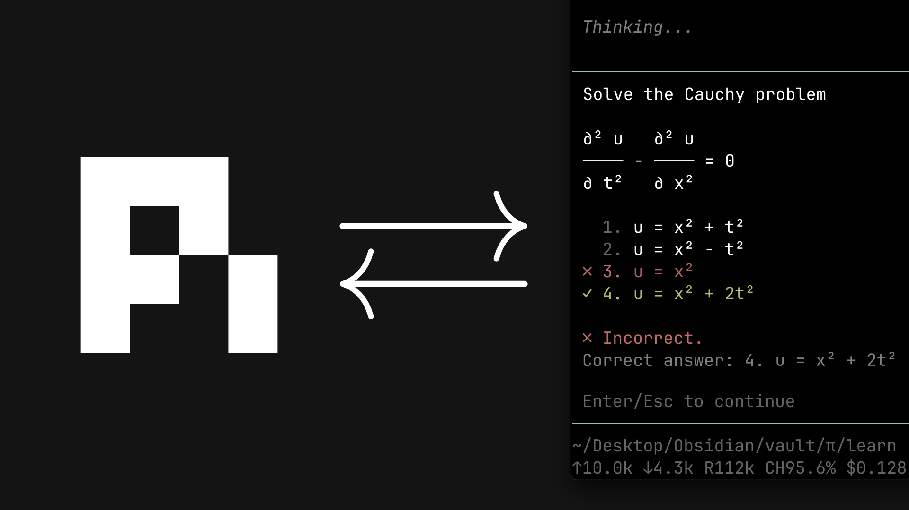

# learn

[](https://www.youtube.com/watch?v=kzcI5F4tGiU)

This is a port of [amosblomqvist's learning system](https://github.com/amosblomqvist/learn) — his AI setup from the video [How I Use AI to Learn Things](https://www.youtube.com/watch?v=kzcI5F4tGiU), originally built as [pi](https://github.com/earendil-works/pi) configuration.

The teaching philosophy, the skills, and the system design are all his; this repo adapts that pi configuration to [OpenCode v2](https://opencode.ai/v2/docs/).

Differences between this repo from upstream is listed in [differences from upstream](#differences-from-upstream) section

> [!WARNING]
> This repo is still in experimental phase. Some stuffs may not work/break.

## What's in it

- `skills/teach/` — the philosophy and the process
- `skills/visualize/` — adds a correct, minimal diagram to a lesson when an idea is clearer as a picture
- `agents/` — `researcher`, `svg-maker`, `mermaid-maker`: the subagents the system delegates to
- `plugins/md-link/` — live-mirrors the session to a markdown file for comfortable reading in Obsidian (assistant replies, your prompts, and quiz Q&A as callouts)
- `plugins/learn-quiz.ts` — the graded `quiz_ask` / `quiz_grade` question pair
- `plugins/learn-viz-tools.ts` + `lib/viz-common.ts` — the `write_*/edit_*/render_*` authoring loops the visual makers use (SVG via `rsvg-convert`, Mermaid via `mmdc`)
- `plugins/learn-viz-tui.ts` — the `/viz-dir` TUI command that sets the viz output directory

## Install

One source copy symlinked to other projects.

**Global** — symlink the items into your OpenCode config; every project gets them without per-project setup:

```bash
./install.sh -g              # symlink into ~/.config/opencode
./uninstall.sh -g            # remove again
```

**Project-level** — symlink into one project (or `git clone <this-repo-url> .opencode`):

```bash
./install.sh ~/Projects/notes        # symlinks into ~/Projects/notes/.opencode
./uninstall.sh ~/Projects/notes
```

Then open `opencode2` in the project. Skills, agents, and all plugins are discovered automatically.

Visuals publish into the session project's `viz/` by default. To always publish somewhere else (an Obsidian vault, say), run `/viz-dir` in the TUI — or point `~/.config/opencode/viz-state.json` at it directly; empty or missing means the project dir:

```json
{ "defaultDir": "/home/you/Notes/viz" }
```

## Requirements

- [OpenCode v2](https://opencode.ai/v2/docs) (`opencode2` beta) — developed against beta-1805x; plugin APIs may still shift
- `rsvg-convert` (librsvg) or ImageMagick — SVG rendering
- `mmdc` (`@mermaid-js/mermaid-cli`) on PATH — Mermaid rendering
- A provider/model for the subagents — edit `agents/*.md` frontmatter to taste
- For the quiz popups: nothing extra — OpenCode v2's TUI renders the question forms natively

## Notes

- The teaching flow: `teach` probes your level with graded quizzes (`quiz_ask`/`quiz_grade`), plans a dependency map, then teaches node by node with a quiz check after each one. Non-graded questions use OpenCode's built-in `question` tool.
- Visuals are never hand-faked: the skill briefs a maker subagent, which authors, renders to PNG, **looks at the result**, iterates, and only then publishes into `viz/` for embedding.
- `md-link` mirrors only reading-relevant content: your prompts, lesson prose, and quiz Q&A. Tool noise (bash, reads, edits) is omitted. Toggle it in the TUI with `ctrl+alt:m` or `/md-link <dir>` — `install.sh -g` registers the TUI module for you. `/md-link-persist` keeps mirrors across TUI restarts and auto-resumes them on next launch; `/md-link` OFF still deletes immediately.

- The makers render but cannot push images into the model's context (v2 beta strips tool-result images) — so `render_*` returns the PNG path and the maker opens it with `read` to inspect. Same verify-by-looking loop, one extra step.
- You can run the system without subagents: the main session does the teaching. You lose the researcher (truth verification) and the generated visuals.

## Differences from upstream

New in this port:

- **Symlinking installer** — `install.sh -g` links one repo copy into your global config (or per project with `install.sh <dir>`); a manifest tracks every link and `uninstall.sh` removes exactly those. Upstream was `git clone` as `.pi` only.
- **Configurable viz output** — `viz-state.json` (`defaultDir`) sends published visuals to any directory; upstream always wrote to `<cwd>/viz`.
- **md-link TUI toggle** — `ctrl+alt:m` / `/md-link` with per-session enable, default dir, and keep-N settings; upstream had `/md-log` / `/md-unlog` commands only.

Behavior changes:

- **quiz is two tools** — `quiz_ask` poses the question, `quiz_grade` carries the answer. The TUI shows raw tool arguments, so splitting at the answer boundary makes the correct answer structurally invisible until after you answer (upstream hid it inside the popup renderer).
- **No `ask-user-question` extension** — OpenCode v2's built-in `question` tool covers non-graded questions.
- **No subagent extension** — v2's built-in `subagent` tool replaces `pi-interactive-subagents` (upstream's recommended tmux-only dependency).
- **Render-and-inspect via path** — v2 strips images from tool results, so `render_*` returns the PNG path and the maker opens it with `read` (upstream returned the image inline).
- **Linux-first rendering** — `mmdc` / `rsvg-convert` from PATH instead of a bundled mermaid-cli and macOS Chrome paths.

## Credits

- **amosblomqvist** — original system, teaching philosophy, and video: [amosblomqvist/learn](https://github.com/amosblomqvist/learn) (pi configuration)
- This repository — OpenCode v2 port of that pi configuration; the port mechanics (plugins, forms-based quiz, symlinking installer) are the only new work here
